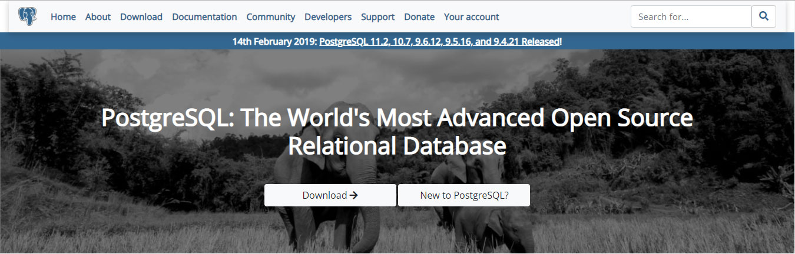
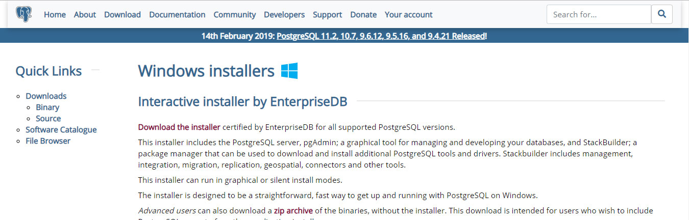
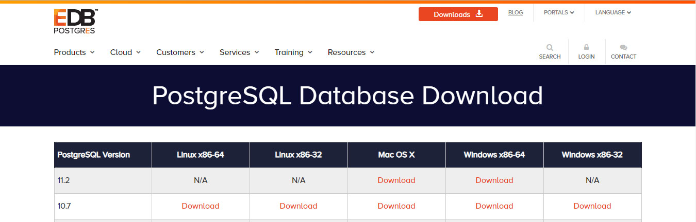
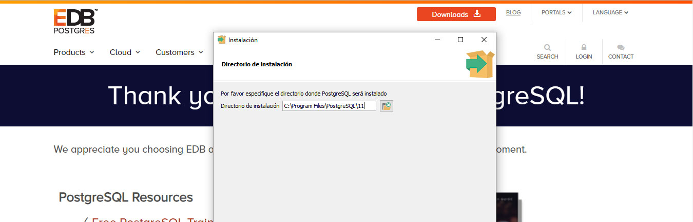
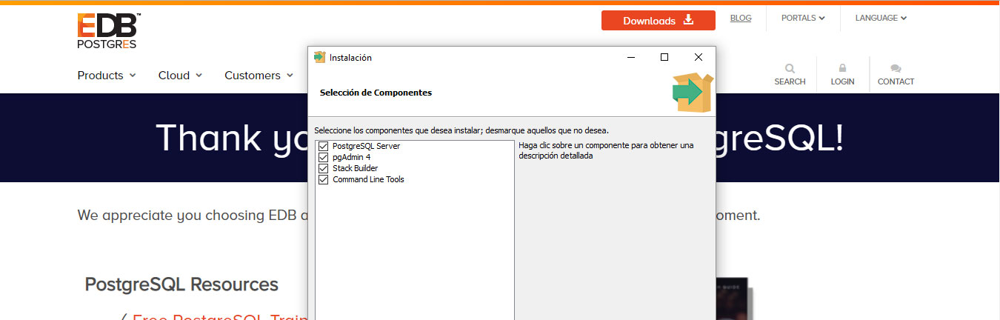
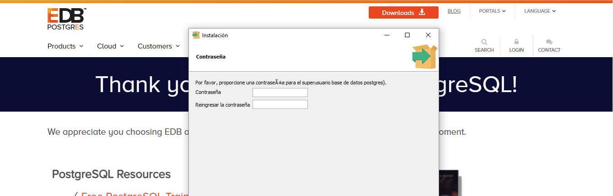
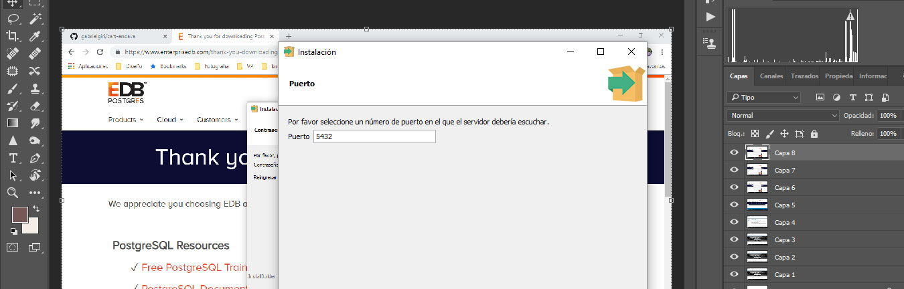
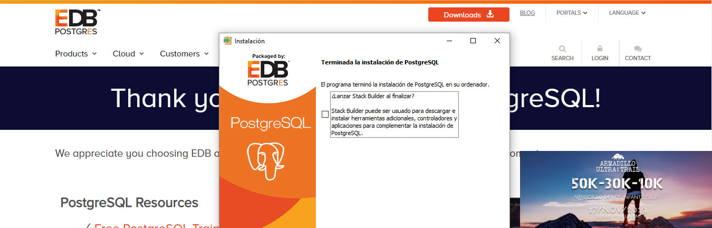

# CART ENDAVA

   ## Preview


## Instalation (linux)
```sh
sudo apt install postgresql                                        # Download  PostgreSQL
git clone https://github.com/gabrielgiri/cart-endava.git           # Clone the repo
cd cart-endava                                                     # Move to the local repository 
npm install                                                        # download the dependencies about back (express y sequelize)
( cd public ; ../node_modules/.bin/bower install )                 # download the dependencies to the  front (angular)
node rebuild_tables.js                                             # Create the DM structure 
node load_fixtures.js                                              # Load data 
node server.js                                                     # inicializate the app
```

# Instalation  (windows)

Download and install  PostgreSQL
See instructions below
```sh
https://www.postgresql.org/
```
### Clone the  repo
```sh
git clone https://github.com/gabrielgiri/cart-endava.git
```
### Move to the local repository 
```sh
cd cart-endava												
```
#### Ensure you have already installed nodeJs & npm:
```sh
node -v
npm -v
```

#### If not, download and install nodejs
```sh
https://nodejs.org/es/download/
```
### Install dependencies to the back-end
```sh
npm install 
```
### Install express
```sh
npm install express
```
### Install sequelize	
```sh
npm install sequelize
```
### Move to the /node_modules/.bin folder and install bower	
```sh
cd node_modules/.bin
npm install bower
```
### Install bower package 
cd .. 
cd .. 
cd public 
on /public folder
```sh
bower Install									
```
In the config.json modify the following fields with the data already setted on PostgreSQL
```sh
{
  "db": {
    "username": "postgres",
    "password": "endava",
    "database": "postgres",
    "host": "127.0.0.1",
    "dialect": "postgres"
  }
}
```
### create the db structure (on root folter)
```sh
node rebuild_tables.js  
```
### Load the data into DB  (on root folter)
```sh
node load_fixtures.js   
```
### Initiliaze the app
```sh
node server.js                                                   
```


# Instalation PostgreSQL (for windows)
- https://www.postgresql.org

- Download the installer

- Select the latest version for windows x86-64

- Select a folder to install PostgreSQL (Recommended default)

- Select all component items

- Enter a superuser DB password (you'll need it later)

- Select a port number for the server (Recommended default)

- Unselect checkbox stack builder (unless you need it)



