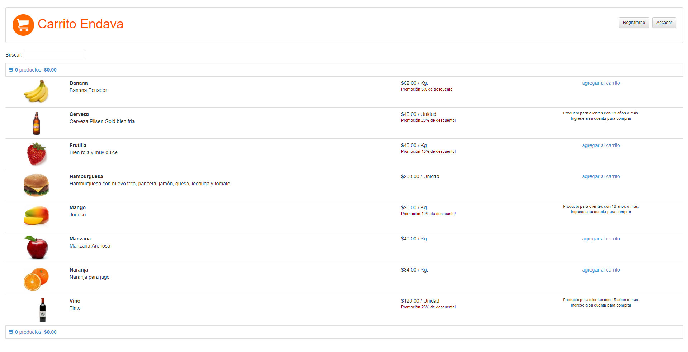

## Preview



# Carrito Endava

## Instalación resumida (linux)
```sh
sudo apt install postgresql                                        # bajar PostgreSQL
git clone https://github.com/gabrielgiri/carrito-endava.git        # clonar el repo
cd carrito-endava                                                  # cambiar a la carpeta del repo local
npm install                                                        # bajar las dependencias del back (express y sequelize)
( cd public ; ../node_modules/.bin/bower install )                 # bajar las dependencias del front (angular)
node rebuild_tables.js                                             # armar la estructura de la BBDD
node load_fixtures.js                                              # cargarla con datos
node server.js                                                     # arrancar la app
```

## Instalación resumida (windows)
```sh
https://www.postgresql.org/                                       # Bajar PostgreSQL
git clone https://github.com/gabrielgiri/carrito-endava.git       # Clonar el repo
cd carrito-endava                                                 # Cambiar a la carpeta del repositorio local
npm install                                                       # Instalar las dependencias del back
npm express                                                       # Instalar express
npm sequelize                                                     # Instalar sequelize
cd public/node_modules/.bin                                       # Ir a la carpeta donde vamos a instalar bower
bower install                                                     # Instalar el gestor de paquetes bower 
node rebuild_tables.js                                            # Armar la estructura de la DB
node load_fixtures.js                                             # Cargar datos en la DB
node server.js                                                    # Inicializar la app
```