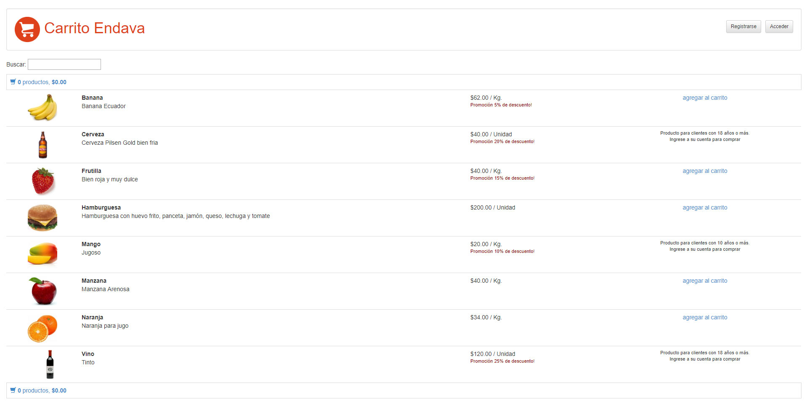

## Preview



## Instalation (linux)
```sh
sudo apt install postgresql                                        # Download  PostgreSQL
git clone https://github.com/gabrielgiri/cart-endava.git           # Clone the repo
cd cart-endava                                                     # Move to the local repository 
npm install                                                        # download the dependencies about back (express y sequelize)
( cd public ; ../node_modules/.bin/bower install )                 # download the dependencies to the  front (angular)
node rebuild_tables.js                                             # Create the DM structure 
node load_fixtures.js                                              # Load data 
node server.js                                                     # inicializate the app
```

## Instalation  (windows)
```sh
# Download and install  PostgreSQL
https://www.postgresql.org/

# Clone the  repo
git clone https://github.com/gabrielgiri/cart-endava.git

# Move to the local repository 
cd cart-endava												

#Ensure you have already installed nodeJs & npm:
node -v

#You must see something like:
#v6.10.3

npm -v
#You must see something like:
#6.1.0

#If not install nodejs
https://nodejs.org/es/download/

# Install dependencies to the back-end
npm Install 
# Install express												
npm express	
# Install sequelize												
npm sequelize		
# Move to the /node_modules/.bin folder to install bower										
cd public/node_modules/.bin
# Install bower package 
bower Install									

In the config.json modify the following fields with the data already setted on PostgreSQL
{
  "db": {
    "username": "postgres",
    "password": "endava",
    "database": "postgres",
    "host": "127.0.0.1",
    "dialect": "postgres"
  }
}

# create the db structure
node rebuild_tables.js  
# Load the data into DB
node load_fixtures.js       
# Inicilaize the app
node server.js                                                   


```
